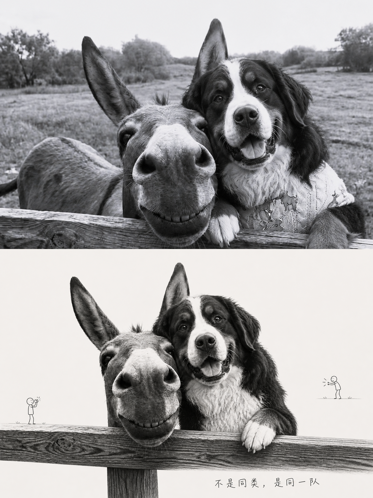
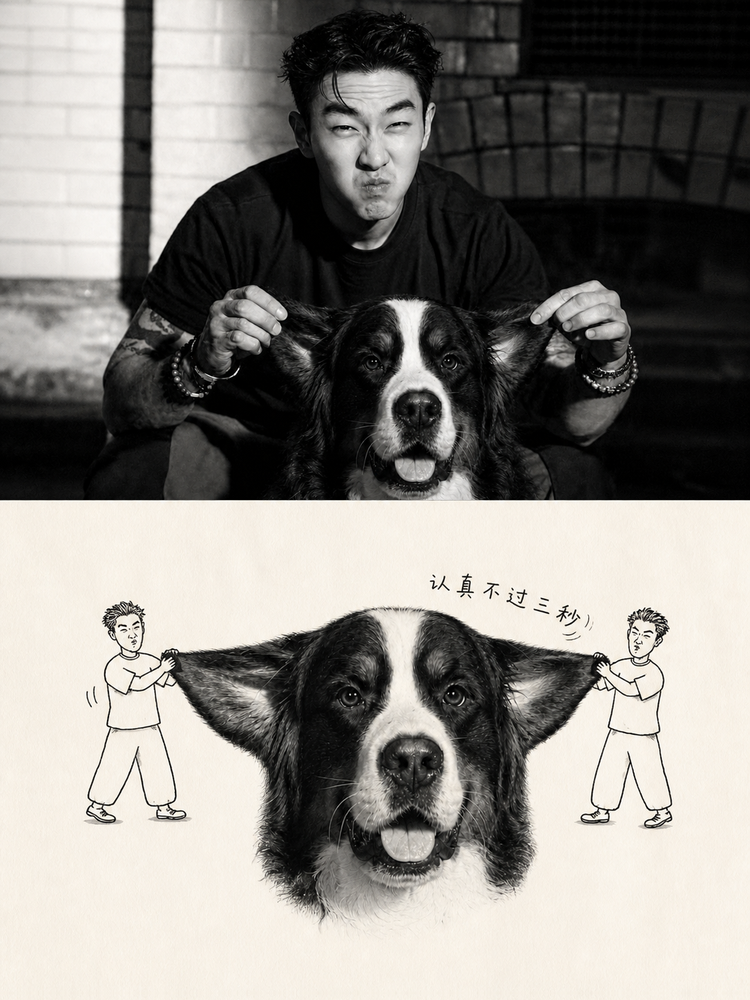

# silas-photo-to-doodle-editorial-poster

一个可复用的 Codex Skill：把每张上传照片分别转成独立的 3:4 高级编辑海报。上半区忠实保留原照片，下半区从真实关系与寓意出发，以摄影主体、极简黑线涂鸦小人、手写短句和大量留白完成二次叙事。

## 与黑白手绘双画面 Skill 的区别

本 Skill 的下半区是 **真实主体＋黑线涂鸦小人**，真实主体不改画成素描或蜡笔画。

“原照＋同主体黑白手绘重绘”属于另一个独立 Skill：[Silas 照片转黑白手绘双画面海报](https://github.com/SilasMaker/silas-photo-to-ink-diptych)。两者分别安装、分别调用，不互相替代。

## 适用场景

- 人物、宠物与人宠合照
- 植物、食物、建筑、器物、交通工具与自然场景
- 生活方式杂志、独立出版物、艺术摄影与社交媒体竖版海报
- 需要逐张输出、禁止多图拼接的批量照片任务

## 核心特点

- 先读动作、关系、情绪与反差，再选择视觉锚点。
- 每张照片独立输出；默认不做拼图。
- 3:4 画布，上下严格 1:1，各由一个 3:2 面板组成。
- 上半区使用原照片，不以近似重绘替代。
- 下半区保留关系主体的真实身份与材质，涂鸦只承担微型叙事。
- 对人物和宠物关系做强约束：不能只留下爪子、袖口或影子。
- 对无人物照片做溯源约束：不能凭空添加与原图无关的真实象征物。
- 验证中文文案、几何比例、身份一致性与版本化保存。

## 安装

```bash
git clone https://github.com/SilasMaker/silas-photo-to-doodle-editorial-poster.git \
  ~/.codex/skills/silas-photo-to-doodle-editorial-poster
```

重新打开 Codex 任务后即可使用。

## 调用

上传一张或多张照片，然后输入：

```text
使用 $silas-photo-to-doodle-editorial-poster，把我上传的每张照片分别制作成独立的 3:4 编辑海报。
```

也可以补充想保留的文案、色彩或情绪；未指定时，Skill 会从原图关系中生成。

## 效果示例

示例用于识别本 Skill 的“真实主体＋黑线小人”视觉语言，不覆盖每次任务的主体保留要求。例如下方拉耳图将真人转成线描小人；若用户要求人和狗都保持真实，该图不能作为主体保留的合格范本，新制作须遵守完整关系主体保留规则。

### 不是同类，是同一队

[](examples/01-donkey-and-bernese-poster.png)

### 认真不过三秒

[](examples/02-serious-for-three-seconds-poster.png)

## 目录

```text
.
├── SKILL.md
├── agents/
│   └── openai.yaml
├── examples/
│   ├── 01-donkey-and-bernese-poster.png
│   └── 02-serious-for-three-seconds-poster.png
└── references/
    └── prompt-template.zh-CN.md
```

## 隐私

此公开包不包含用户原始照片或身份参考。`examples/` 仅包含用户明确授权公开的两张成品海报；Skill 默认把其他输入与输出视为私密素材，除非用户明确授权具体文件，否则不得把它们复制进公开仓库。

## License

[MIT](LICENSE)
