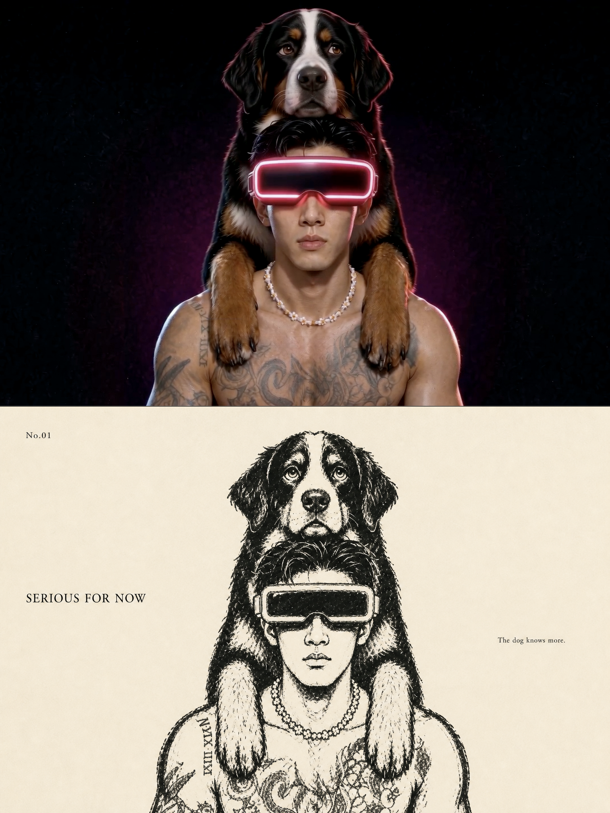
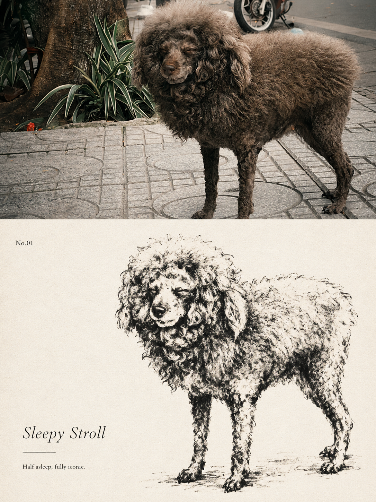

# silas-photo-to-doodle-editorial-poster

一个可复用的 Codex Skill：把每张上传照片分别转成独立的 3:4 高级编辑海报。上半区直接使用原照片，下半区把同一主体和关系重绘为黑色粗蜡笔、炭笔与干刷手绘，并以米白纸张、大面积留白和克制英文排版完成双画面叙事。

## 适用场景

- 人物、宠物与人宠合照
- 植物、食物、建筑、器物、交通工具与自然场景
- 生活方式杂志、独立出版物、艺术摄影与社交媒体竖版海报
- 需要逐张输出、禁止多图拼接的批量照片任务

## 核心特点

- 先读动作、关系、表情与反差，再决定保留哪些身份锚点。
- 每张照片独立输出；默认不做拼图。
- 3:4 画布，上下严格 1:1，各由一个 3:2 面板组成。
- 上半区使用处理后的原照片像素，不以近似重绘替代。
- 下半区保留同一主体、表情、姿势、花纹和关系，不加入微型涂鸦角色。
- 只使用黑色颜料与暖米白纸色，保留粗笔、断线、露白和纸张纹理。
- 默认使用 `No.XX`、2–4 词英文标题和一句极短英文小字。
- 对最终上下半区做像素匹配，并验证几何比例、文字与版本化保存。

## 安装

```bash
git clone https://github.com/SilasMaker/silas-photo-to-doodle-editorial-poster.git \
  ~/.codex/skills/silas-photo-to-doodle-editorial-poster
```

重新打开 Codex 任务后即可使用。

## 调用

上传一张或多张照片，然后输入：

```text
使用 $silas-photo-to-doodle-editorial-poster，把我上传的每张照片分别制作成上半原照、下半黑白粗蜡笔重绘的独立 3:4 编辑海报。
```

也可以补充想保留的文案、色彩或情绪；未指定时，Skill 会从原图关系中生成。

## 效果示例

### Serious for Now

[](examples/03-serious-for-now-bernese-poster.png)

### Sleepy Stroll

[](examples/04-sleepy-stroll-poodle-poster.png)

### 历史示例：不是同类，是同一队

[](examples/01-donkey-and-bernese-poster.png)

### 历史示例：认真不过三秒

[](examples/02-serious-for-three-seconds-poster.png)

## 目录

```text
.
├── SKILL.md
├── agents/
│   └── openai.yaml
├── examples/
│   ├── 01-donkey-and-bernese-poster.png
│   ├── 02-serious-for-three-seconds-poster.png
│   ├── 03-serious-for-now-bernese-poster.png
│   └── 04-sleepy-stroll-poodle-poster.png
└── references/
    └── prompt-template.zh-CN.md
```

## 隐私

此公开包不包含用户原始照片或身份参考。`examples/` 仅包含用户逐次明确授权公开的成品海报；Skill 默认把其他输入与输出视为私密素材，除非用户明确授权具体文件，否则不得把它们复制进公开仓库。

## License

[MIT](LICENSE)
